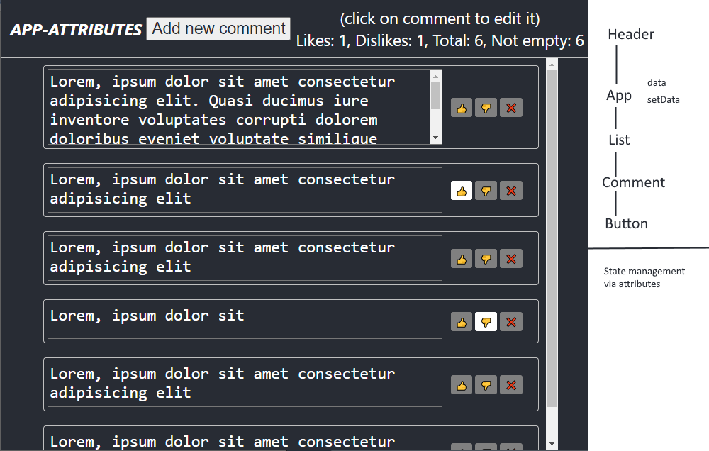

# react-redux
State management in react

3 applications are presented with different ways of working with state: through component attributes, pure redux and redux toolkit

## Component attributes

At the top level, states are defined and passed along the cap to nested components with setters to notify about changes. The logic for working with states is inside the components.   
Open the [app-attributes](app-attributes) folder in Visual Studio Code, install the modules via yarn and run the Debug configuration.

## Pure redux

There is no longer any need to pass data and setters along the chain of components. Any component has access to the application state, and changing the state is carried out through actions in the reducer.   
[app-pure-redux](app-pure-redux) is a copy of [app-attributes](app-attributes) with additional code for redux. All direct data manipulation has been removed from the components.

## Redux toolkit

It's easier to create a store. Instead of a reducer, we create a slice within which we can change states. You no longer need to define actions separately.   
Source code in the [app-rtk](app-rtk) folder.

