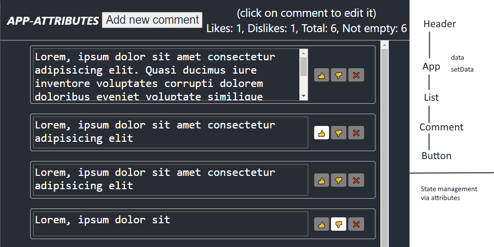

# react-redux
State management in react

3 applications are presented with different ways of working with state: through component attributes, pure redux and redux toolkit

## Component attributes

At the top level, states are defined and passed along the cap to nested components with setters to notify about changes. The logic for working with states is inside the components.   
Open the `app-attributes` folder in Visual Studio Code, install the modules via YARN and run the Debug configuration.
